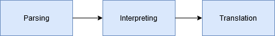

# Search2SQL

Search2SQL can be used to convert a search expression to a usable SQL query. This free, open-source library is intended to be very flexible and so it can be used for a lot more.

 > #### Note
 > This is currently just a demo and just provides some basic implementations. This library is currently not meant to be used and since it isn't finished yet.
 > I've planned to add a lot more different implementations.

---

#### Libray Scheme
The library has three phases it walks through. Each phase can be used seperately. If you are using a NoSQL database, you can stop between after the second and then continue differently.

##### 1. Parsing
This phase is really close to the second step `Ìnterpreting`. The `Interpreter` searches every class that defines the `@SearchParser` annotation. After that the whole search expression will be split in sub-queries. These queries will be parsed as `SubQuery`'s.

##### 2. Interpreting
As already mentioned this is nearly the same step as `Parsing`. In this phase the search expression will be interpreted and parsed by the `Parser`'s. 

##### 3. Translating
In this last phase the parsed&interpreted list of `SubQuery`'s will be translated to SQL. 

---

The library was designed that there are specialized implementations of `Parser`, `Interpreter` and `Translator`. e.g.: `DateParser` (designed to parse dates), `LogicInterpreter` (can interpret `and`, `or`, etc.) or `PostgresTranslator` (translates valid PostgresSQL). The [Decorator Pattern](https://en.wikipedia.org/wiki/Decorator_pattern) will be also part of the next versions.

This is just a quick guide to show how powerful the idea behind Search2SQL really is. As already said this is a really basic demo, a better documentation and more implementations are coming.
